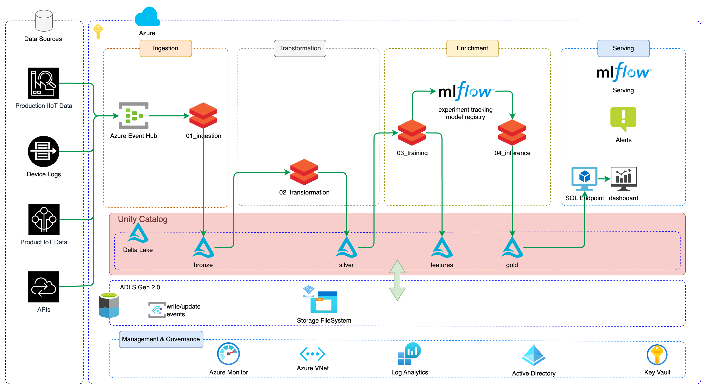

# Real-time monitoring and anomaly detection on streaming IoT pipelines in Manufacturing

In the modern manufacturing industry, real-time monitoring and anomaly detection are crucial for maintaining operational efficiency and preventing costly downtimes. By leveraging synthetic data, we can simulate various scenarios and train a decision tree classifier to identify potential anomalies in the streaming IoT data pipelines. This approach allows us to infer and score the data in real-time, ensuring that any deviations from the norm are promptly detected and addressed.

In this project, we will create a robust pipeline that ingests streaming IoT data, processes it using a decision tree classifier, and visualizes the detected anomalies on a comprehensive dashboard. This dashboard will provide actionable insights, enabling manufacturers to take proactive measures to mitigate risks and optimize their operations.

The following steps outline the process:
1. Generate synthetic IoT data to simulate real-world manufacturing scenarios.
2. Train a decision tree classifier on the synthetic data to identify patterns and detect anomalies.
3. Deploy the trained model to perform real-time inference and scoring on the streaming data.
4. Build a dashboard to visualize the detected anomalies and provide insights for decision-making.

By implementing this solution, manufacturers can enhance their monitoring capabilities, quickly identify and respond to anomalies, and ultimately improve their overall operational efficiency.