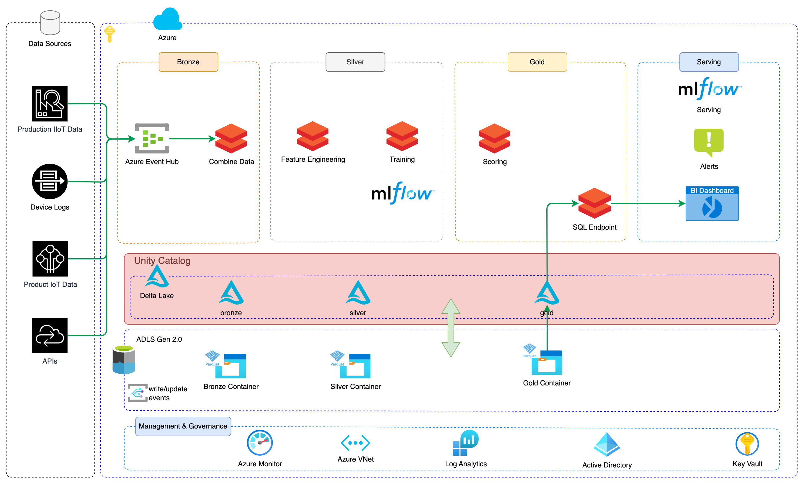

# Real-time monitoring and anomaly detection on streaming IoT pipelines in Manufacturing

Requirements
For current release support, see “Latest Releases” in the Azure Event Hubs Spark Connector project readme file.

Create a library in your Azure Databricks workspace using the Maven coordinate com.microsoft.azure:azure-eventhubs-spark_2.11:2.3.17.

Note

This connector is updated regularly, and a more recent version may be available: we recommend that you pull the latest connector from the Maven repository

Install the created library into your cluster.
