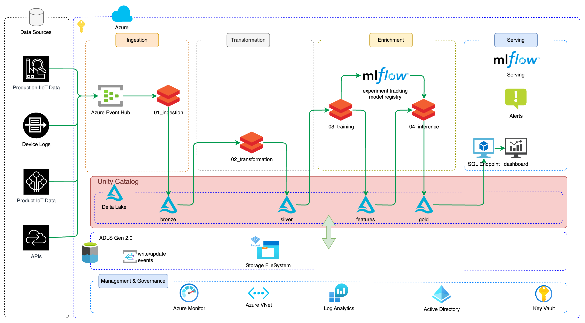

# CNC Predictive Maintenance

In today’s industrial landscape, maintenance is often reactive rather than proactive, resulting in costly downtime, unexpected repairs, and dissatisfied customers. Our CNC Predictive Maintenance solution empowers businesses to shift towards predictive maintenance strategies, allowing them to identify and address potential issues before they escalate into critical problems.

## About the Solution

This showcase highlights a CNC predictive maintenance solution implemented on Databricks, leveraging advanced machine learning techniques to predict machine failures. The foundation of this solution is a meticulously crafted dataset that accurately reflects real-world machining conditions, created by the School of Engineering - Technology and Life.

### Key Dataset Features

The synthetic dataset is modeled after a real milling machine and contains 10,000 data points, each represented as rows with 14 features in columns. The key features include:

- `UID`: A unique identifier ranging from 1 to 10,000.
- `Product ID`: Combines a quality variant (L, M, H for low, medium, and high) and a variant-specific serial number. Distribution: 50% L, 30% M, 20% H.
- `Type`: Extracted from the Product ID, indicating the product quality variant (L, M, or H).
- `Air Temperature [K]`: Simulated using a random walk process, normalized to a standard deviation of 2 K around 300 K.
- `Process Temperature [K]`: Generated as the air temperature plus 10 K, with a random walk normalization to a standard deviation of 1 K.
- `Rotational Speed [rpm]`: Calculated from a power of 2860 W, with normally distributed noise added.
- `Torque [Nm]`: Normally distributed around 40 Nm with a standard deviation of 10 Nm, constrained to non-negative values.
- `Tool Wear [min]`: Varies by product quality (H/M/L adds 5/3/2 minutes of wear per usage).
- `Machine Failure`: A binary label indicating if the machine failed during a specific data point due to any of the following independent failure modes:
  - `Tool Wear Failure (TWF)`: Tool fails or is replaced when wear time exceeds 200-240 minutes. Occurs 120 times, with 69 replacements and 51 failures.
  - `Heat Dissipation Failure (HDF)`: Occurs when the temperature difference between air and process is below 8.6 K, and rotational speed is below 1380 rpm. Found in 115 instances.
  - `Power Failure (PWF)`: Happens when the product of torque and rotational speed results in a power below 3500 W or above 9000 W. Observed 95 times.
  - `Overstrain Failure (OSF)`: Triggered when the product of tool wear and torque exceeds 11,000 minNm (L), 12,000 minNm (M), or 13,000 minNm (H). Occurs in 98 instances.
  - `Random Failure (RNF)`: A 0.1% chance of random failure, observed only 5 times in the dataset.

This dataset accurately simulates real-world machining conditions and provides a robust foundation for predictive maintenance using machine learning.

## Comprehensive Machine Learning Pipeline

Our solution offers an end-to-end machine learning pipeline that includes:

- Data Preparation: Tools to clean, process, and structure IoT datasets for analysis.
- Model Training: Automated pipelines for building and optimizing predictive models.
- Root Cause Analysis: Reporting tools to understand underlying causes of anomalies and machine failures.

## Scalable and Business-Centric

Scaling existing codebases and skill sets is at the heart of this solution. IoT and anomaly detection use cases often involve vast data volumes, posing challenges for traditional tools. This solution bridges the gap by integrating seamlessly with Databricks, enabling data scientists to:

- Analyze massive datasets efficiently.
- Transition easily from small-scale Pandas workflows to distributed data processing.
- Diagnose complex issues, such as unexplained increases in engine defect rates, without requiring additional expertise in distributed systems.

With this solution, businesses can future-proof their operations by combining scalability, precision, and ease of use, ensuring a proactive approach to CNC maintenance and overall operational efficiency.
